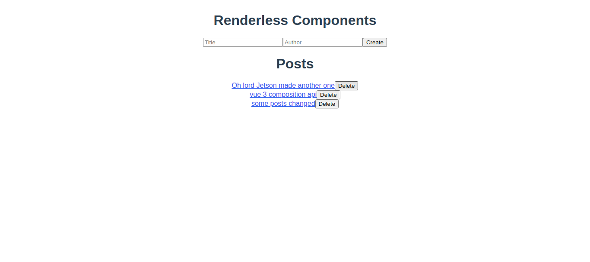
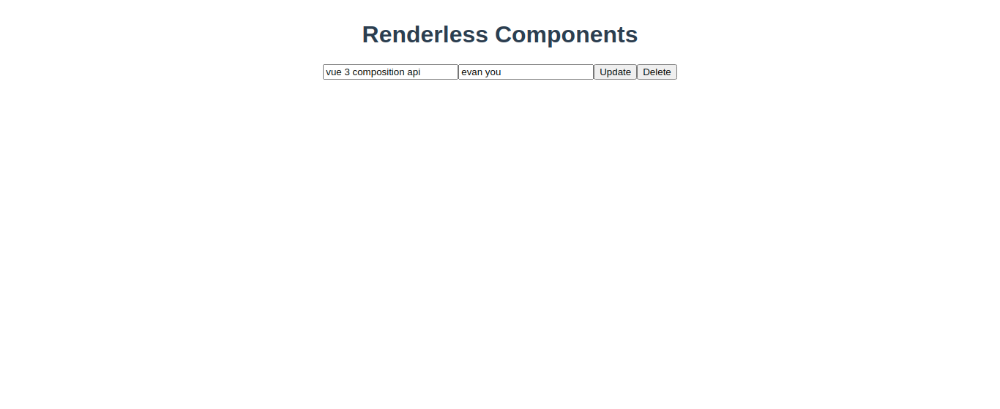

# Vue မှာ Renderless component တစ်ခုဘလို create လုပ်မလဲ?

## Renderless component ဆိူတာ ဘာလဲ?

> `Renderless component` ဆိူတာ သူ့ကိုယ်ပိုင် HTML render မလုပ်တဲ့ component မျိူး
> သူက ေနfunctionality နဲ့ behaviour ေပးမယ် layoutေတွ Mark upေတွ ကိုေတာ့ parent component ဆီက ရမယ်
> အက်တာေကြာင့် component ေတွက reusable ဖြစ်သွားမယ်

**ဥပမာ**
<br>

common use caseတစ်ခုအ ေနနဲ့ဆိုရင်
Serverက ေန data လှမ်း fetchပြီး ရလာတဲ့ dataေတွကို list တခုအ ေနနဲ့ render လုပ်ချင်တယ်ဆိုရင်လည်း logic ပဲ ေပးမှာဖြစ်လို့ markup and layout ကိုကြိုက်သလို စီမံလို့ရသွားမယ်
တကယ့် logic နဲ့ visual representation ဖြစ်တဲ့ markupေတွ layoutေတွ သီးသန့်ဆီဖြစ်သွားတဲ့အတွက် reusableဖြစ်သွားမယ်

<br>
CRUD operationနဲ့ပဲ စဥ်းစားကြည့်မယ်ဆိုရင် create,read,update,delete အကုန်လံုးကို renderless component က ေန pass လုပ် ေပးလိုက်တဲ့ dataေတွ methodေတွသံုးပြီး လုပ်နိုင်သွားမယ်

<br>
<br>
ဒီ article မှာေတာ့ CRUD operationအကုန်လုံးကို renderless componentတစ်ခုတည်းကို သုံးပြီး လုပ်နိုင် ေအာင် create လုပ်သွားပါ့မယ်

> ဒီ article အတွက် အနည်းဆုံး vue basic ေကာင်းေကာင်း နားလည်မှ အဆင် ေပြပါလိမ့်မယ်

<br>
<br>
ပထမဆုံး vue project တစ်ခု ကို Vue CLI နဲ့ create လုပ်ပါ့မယ်
<br>

```
vue create renderless-component
```

ဘာ code မှ မ ေရးခင်မှာ လိုအပ်မယ့် dependency ေတွကို install အရင်လုပ်ပါ့မယ်

<small>API call handle လုပ်ဖို့အတွက်</small>

```
npm install axios
```

<small>fake server တစ်ခု ့ host ဖို့အတွကိ</small>

```
npm install -g json-server
```

dependency ေတွ install ပြီးရင် fake JSON server တစ်ခုcreate လုပ်ဖို့အတွက် root folderထဲမှာ `db.json` ဆိုတဲ့ JSON file တစ်ခု create လုပ်ပြီး initial dataေတွ ထည့်ထားပါမယ်

```json
{
  "posts": [
    {
      "title": "renderless components vuejs",
      "author": "evan you",
      "id": "8eb92a29-06fc-49d2-a110-9931351d0d8b"
    },
    {
      "title": "Oh lord Jetson made another one",
      "author": "Jetson",
      "id": "721dfa2f-fd70-49aa-b624-cd8ef74821ae"
    },
    {
      "title": "vue 3 composition api",
      "author": "evan you",
      "id": "a1fb543f-dc82-4f24-ae75-6043f0e08a32"
    }
  ]
}
```

ပြီးရင် fake JSON server ကို start လိုက်ပါမယ်

```
json-server --watch db.json
```

`http://localhost:3000/posts` ဆိုတဲ့ url ကိုသွားလိုက်ရင် JSON object ေတွပါတဲ့ Array တစ်ခုကို ေတွ့ပါလိမ့်မယ်

ပြီးရင် `src/components` folder ထဲမှာ ကြိုက်တဲ့ နာမည်နဲ့ component တစ်ခု create လုပ်လိုက်ပါ

```javascript
//src/components/data-model-crud.vue
<script>
//post id တစ်ခုချင်းဆီအတွက် unique id ထုတ် ေပးမယ့် function
function uniqueId(){

      return ([1e7] + -1e3 + -4e3 + -8e3 + -1e11).replace(/[018]/g, c =>
    (
      c ^
      (crypto.getRandomValues(new Uint8Array(1))[0] & (15 >> (c / 4)))
    ).toString(16)
  );
}
import axios from 'axios';
export default {
  props: {

    baseUrl: {
      type: String,
      default: "http://localhost:3000"
    },
    //posts အပြင် တခြား endpoint ေတွအတွက်ပါ reusable ဖြစ် ေအာင် props ေတာင်းပါ့မယ်
    endpoint: {
      type: String,
      required: true
    },
    // specific post တစ်ခုတည်းကို fetch ချင်ရင်ရ ေအာင် postIDေတာင်းပါမယ်
    postID: {
      type: [Number, String]
    }
  },
  data() {
    return {
      data: null,
      loading: false
    };
  },
  created() {
    //component create လုပ်တဲ့အချိန်မှာ postID propsမ ေပးထားရင် postအကုန် fetchပါမယ်
    //ေပးထားရင် ေတာ့ အက် ေကာင်ကိုပဲfetchလုပ်မယ်
    if (this.postID) {
      this.read();
    } else {
      this.readAll();
    }
  },
  methods: {
    async crud(type, ...params) {
      this.loading = true;
      await axios[type](...params)
        .then(response => {
          this.data = response.data;
          //success ဖြစ်ရင် တစ်ခုခုလုပ်လို့ရ ေအာင် parent ကို succes event တစ်ခု emitေပးလိုက်ပါမယ်
          this.$emit(`success`, this.data);
          this.loading = false;
        })
        .catch(error => {
          //error ဖြစ်ရင် တစ်ခုခုလုပ်လို့ရ ေအာင် parent ကို error event တစ်ခု emitေပးလိုက်ပါမယ်
          this.$emit("error", error);
          this.loading = false;
        });
    },
    readAll() {
      return this.crud("get", `${this.baseUrl}/${this.endpoint}`);
    },
    read() {
      return this.crud("get",`${this.baseUrl}/${this.endpoint}/${this.postID}`);
    },
    create(data) {
      data.id = uniqueId();
      return this.crud("post", `${this.baseUrl}/${this.endpoint}`, data);
    },
    destroy(id) {
      return this.crud("delete", `${this.baseUrl}/${this.endpoint}/${id}`);
    },
    update(id, data) {
      return this.crud("patch", `${this.baseUrl}/${this.endpoint}/${id}`, data);
    }
  },
  //render function က ေန vnode ေတွparent ကိုေပးရမယ့်အစား parent ရဲ့ v-slotထဲကို slot scopeအ ေနနဲ့ dataေတွmethod ေတွ pass လုပ် ေပးလိုက်ပါ့မယ်
  //ပုံမှန်ဆို render function က h() functionက ေန vnode create လုပ်ပြီး vnode ေတွ return ပြန် ေပးေလ့ ရိုပါတယ်
  render() {
    return this.$scopedSlots.default({
      loading: this.loading,
      data: this.data,
      create: this.create,
      read: this.read,
      readAll: this.readAll,
      destroy: this.destroy,
      update: this.update
    });
  }
};
</script>
```


post fetchပြီး ရလာတဲ့ေကာင် ေတွကို list အ ေနနဲ့ render ပြန်လုပ်ပါ့မယ်

```html
<template>
  <div>
    <data-model-crud endpoint="posts">
      <template v-slot="{ data: posts}">
        <div v-if="!!posts">
          <div>
            <h1>Posts</h1>
            <ul v-for="post in posts" :key="post.id">
              <li>{{post.title}}</li>
            </ul>
          </div>
        </div>
        <div v-else>Loading.........</div>
      </template>
    </data-model-crud>
  </div>
</template>

<script>
  import DataModelCrud from "@/components/data-model-crud";
  export default {
    components: {
      "data-model-crud": DataModelCrud,
    },
  };
</script>

<style></style>
```

CRUD operation အကုန် မလုပ်ခင် specific post တစ်ခု fetch လုပ်ပြီး render လုပ်ဖို့ `src/views/` ထဲမှာ component တစ်ခု create လုပ်ပါမယ်

`src/views/Post.vue`

```html
<template>
  <div>
    <data-model-crud endpoint="posts" :postID="$route.params.id">
      <template
        v-slot="{ data: post,  create , read , readAll , update , destroy }"
      >
        <div v-if="!!post">
          <form>
            <input v-model="post.title" />
            <input v-model="post.author" />
            <button @click="update(post.id,post)">Update</button>
            <button @click="destroy(post.id);readAll();">Delete</button>
          </form>
        </div>
        <div v-else>Loading..........</div>
      </template>
    </data-model-crud>
  </div>
</template>

<script>
  import DataModelCrud from "@/components/data-model-crud";
  export default {
    components: {
      DataModelCrud,
    },
  };
</script>

<style></style>
```

CRUD operation အကုန်လုံးပါတဲ့ component create လုပ်ဖို့ `src/views/` folder ထဲမှာ component တစ်ခု create လုပ်ပါမယ်


`src/views/Posts.vue`

```html
<template>
  <div>
    <data-model-crud endpoint="posts">
      <template
        v-slot="{ data: posts,  create , read , readAll , update , destroy }"
      >
        <div v-if="!!posts">
          <form>
            <input v-model="newPost.title" />
            <input v-model="newPost.author" />
            <button @click="create(newPost);readAll();">Create</button>
          </form>

          <div>
            <h1>Posts</h1>
            <div v-for="post in posts" :key="post.id">
              <router-link :to="{name:'post',params:{id:post.id}}">
                <span>{{post.title}}</span>
              </router-link>

              <button small @click="destroy(post.id);readAll();">Delete</button>
            </div>
          </div>
        </div>
        <div v-else>Loading.........</div>
      </template>
    </data-model-crud>
  </div>
</template>

<script>
  import DataModelCrud from "@/components/data-model-crud";
  export default {
    components: {
      "data-model-crud": DataModelCrud,
    },
    data() {
      return {
        newPost: {
          title: "",
          author: "",
        },
      };
    },
  };
</script>

<style></style>
```

`src/router/router.js` file ထဲမှာ route conifguration လုပ်ပါမယ်

```javascript
import Vue from "vue";
import VueRouter from "vue-router";

import Posts from "@/views/Posts.vue";
import Post from "@/views/Post.vue";

Vue.use(VueRouter);

const routes = [
  {
    path: "/",
    name: "posts",
    component: Posts,
  },
  {
    path: "/:id",
    name: "post",
    component: Post,
  },
];

const router = new VueRouter({
  mode: "history",
  base: process.env.BASE_URL,
  routes,
});

export default router;
```

**`All Posts with crud operation`**



**`One Post with crud operation`**




## နိဂုံးချုပ်

ဒီ Article မှာ scoped slot ရဲ့ အသုံး၀င်နိုင်တဲ့ use case တစ်ခုကိုပဲ ေပြာပြထားပါတယ်
<br>
scoped slot ေတွအ ေကြာင်း ဖတ်ချင်ရင် [ဒီdocumentataion](https://vuejs.org/v2/guide/components-slots.html) မှာ သွားဖတ်လို့ရပါတယ်
<br>
project folder လိုချင်ရင် [ဒီRepository](https://github.com/Kaung-HtetKyaw/vue-renderless-example.git) မှာ သွားယူနိုင်ပါတယ်


