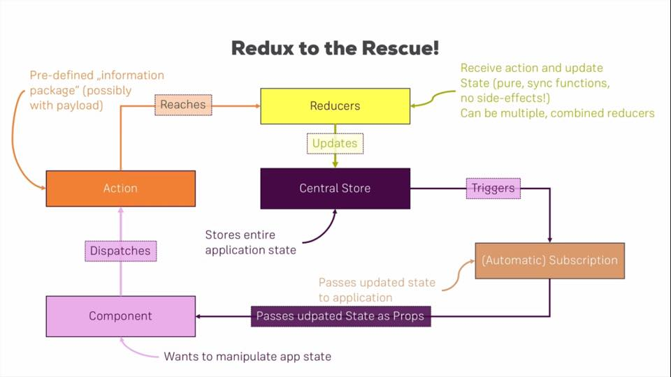

# A brief flow of redux

> Redux မှာ သူ့ရဲ့အလုပ်လုပ်တဲ့ flowကို Flux pattern ပေါ်မှာအခြေခံထားပြီးတည်ဆောက်ထားပါတယ်

သူအလုပ်လုပ်ပုံမပြောခင် သူ့မှာဘာတွေပါလဲအရင်ကြည့်ရအောင်

1. Store
   သူက application တစ်ခုလုံးရဲ့ state ( data )ကိုသိမ်းတဲ့နေရာ

2. Action
   သူက information package တစ်ခု သူ့မှာ information ရဲ့ type ရယ် payload ( Data ) ပါတယ်

3. Reducers
   သူက store က state ကို manipulation လုပ်တဲ့အရာ

4. Subscription
   သူက store ကနေ state တွေကို component တွေဆီပို့တဲ့အရာ

ဘယ်လိုအလုပ်လုပ်လဲဆိုတော့
`Component -> Action -> Reducers -> Store -> Subscription -> Component`

`Flux pattern` ရဲ့သဘောတရားအတိုင်း flow က `one direction` ပဲသွားပါတယ်

အရင်ဆုံး component တစ်ခုက application ရဲ့ state ကို manipulation လုပ်ချင်ရင် component ကနေ store ကိုတိုက်ရိုက်သွားမလုပ်ဘူး သူကနေ action တစ်ခုလွှတ်တယ် <small>( dispatch လုပ်တယ်လို့ခေါ်တယ် )</small>

အဲ့ဒီလွှတ်လိုက်တဲ့ action မှာ action ရဲ့ type နဲ့ payload <small>( action ရဲ့ data )</small> ရယ်ထည့်ပေးလိုက်တယ် action ကနေလည်း store ကို direct သွားပြီး process မလုပ်ဘူး အဲ့မလို့ သူ့ကို just a messenger လို့သုံးတာ

လွှတ်လိုက်တဲ့ action ကို reducer ကနေဖမ်းယူတယ် ပြီးရင် ရလာတဲ့ action ရဲ့ type ကိုကြည့်ပြီး သက်ဆိုင်ရာ manipulation ကိုလုပ်တယ် payload ပါရင်သူ့ကိုပါထည့်သုံးတယ်

reducer ကနေ manipulation လုပ်ပြီးရင် update လုပ်လိုက်တဲ့ state ကို store မှာပြန်သိမ်းတယ်
updated state ကို ယူဖို့ component ကနေ store ကို subscription လုပ်ရတယ် store မှာ state update ဖြစ်တိုင်း store ကနေ subscriptionတွေ triggering လုပ်တယ် အဲ့ဒီကနေတစ်ဆင့် state ကို component ဆီ automatic ပို့ပေးတယ်
ပုံလေးကြည့်ရင်ပိုမြင်သွားမယ်ထင်ပါတယ်

